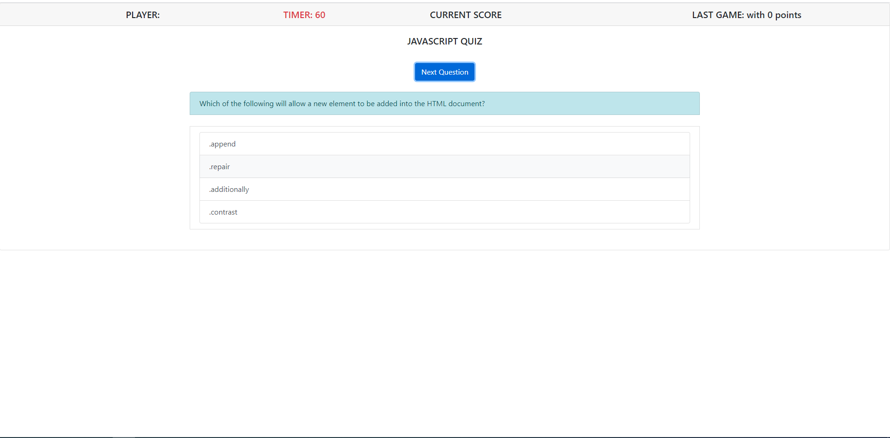

# hw04-js-APIquiz-gt
Homework 04 - Javascript - API quiz

link to the game: https://einobaka.github.io/hw04-js-APIquiz-gt/index.html

Dev notes:
=================
This homework was tough, I did not get all the functionality correctly. Missing components such as: score adding, score save, and subtract from clock.
=================

Screenshot of the game started:

Screenshot of the game when there is a correct answer:

Screenshot of the game when there is an incorrect answer:

